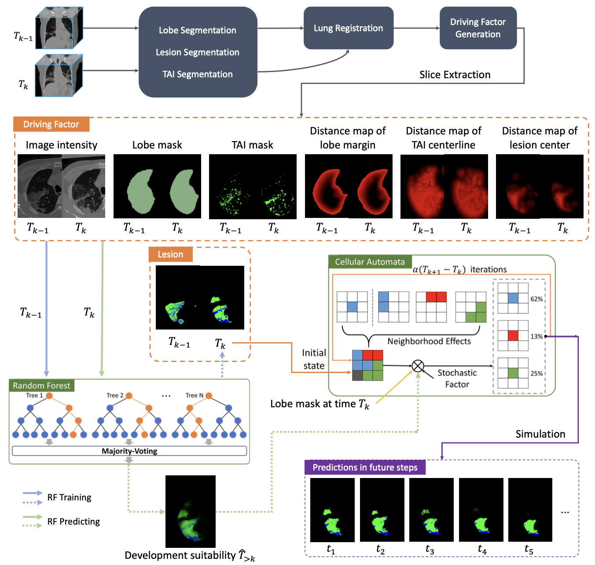
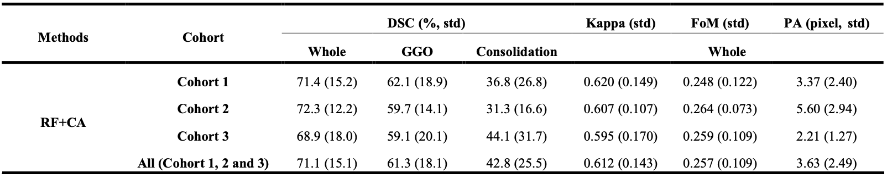
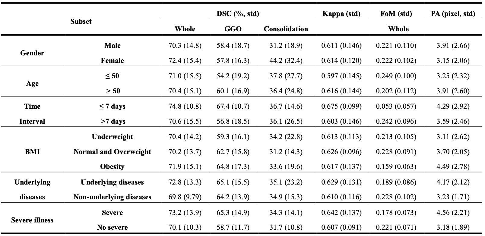
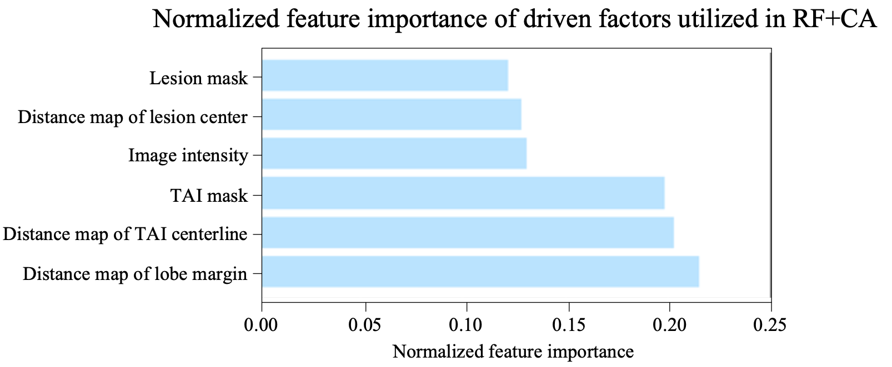
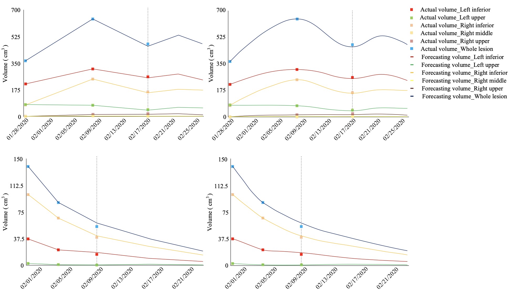

# Voxel-level forecast system for lesion development in patients with COVID-19

This is an opensource project of voxel-level COVID-19 lesion forecast system, which is presented in our paper: [Voxel-level forecast system for lesion development in patients with COVID-19](https://www.medrxiv.org/content/10.1101/2020.12.17.20248377v1). A video demo is also released on [YouTube](https://youtu.be/wtXjiBV87k4).

About the project
------
The global spread of COVID-19 seriously endangers human health and even lives. By predicting patients' individualized disease development and further performing intervention in time, we may rationalize scarce medical resources and reduce mortality.

Based on 1337 multi- stage (≥3) high-resolution chest computed tomography (CT) images of 417 infected patients from three centers in the epidemic area, we proposed a random forest + cellular automata (RF+CA) model to forecast voxel-level lesion development of patients with COVID-19. The model showed a promising prediction performance (Dice similarity coefficient [DSC] = 71.1%, Kappa coefficient = 0.612, Figure of Merit [FoM] = 0.257, positional accuracy [PA] = 3.63) on the multicenter dataset.

Using this model, multiple driving factors for the development of lesions were determined, such as distance to various interstitials in the lung, distance to the pleura, etc. The driving processes of these driving factors were further dissected and explained in depth from the perspective of pathophysiology, to explore the mechanism of individualized development of COVID-19 disease.

## Methods

Lesions in CT of COVID-19 patients are classified into two major types: ground-glass opacity (GGO) and consolidation. GGO is defined as an area with slightly and homogeneously increased in density that does not obscure underlying vascular markings. The consolidation component is defined as an irregular opaque area that completely blurs the underlying vascular markings.

We developed an AI system, which directly took two-stage CT data as input to perform voxel-level forecast of lesion development.

The system consists of four parts: **data pre-processing, lung registration, driving factor generation, and lesion development simulation**. Firstly, three deep learning models were developed to extract three segmentation masks, i.e. a 3D convolutional neural network (CNN) for segmenting the left and right lung into five lobes on all CT scans, a 2.5D CNN for extracting various tubular adjacent interstitials (TAI) including bronchial bundles, vascular bundles, central lobular stroma, and a semi-automatic method for segmenting the lesion regions. Secondly, all CT scans from the same patient were cropped and then aligned to the first stage CT volume based on the extracted lobe masks, using rigid transformation and non-linear B-spline transformation. Thirdly, we extracted three additional driving factors related to lesion development, including the distance map to the margin of lobe mask, distance map to the center of lesion mask, and distance map to the centerline of TAI. Finally, the lesion regions in the third and subsequent stages were predicted based on the extracted information from previous two stages.

In the abovementioned final part, we used random forest classification + cellular automaton (RF+CA) as the voxel-level lesion development forecast model.

## Results

To validate the proposed forecast model, the evolution of lesions in each patient was compared with actual lesions at corresponding stage point by point. Patients were divided into three cohorts corresponding to three different hospitals and each cohort contained 245, 78 and 104 patients, respectively. DSC of 71.1, Kappa of 0.612, FoM of 0.257, and PA of 3.63 were obtained in the dataset consisting of Cohort 1, 2 and 3 for RF+CA based forecast model.

Most of the patients included in this study recorded clinical information such as BMI and underlying diseases. For an in-depth understanding of the lesion development forecast system and characteristics of different population with COVID-19, we further evaluated the proposed model on six subsets of test cohorts based on gender, age (≤50 and >50 years), the interval between 2nd and 3rd CT examinations (≤7 days and >7 days), BMI (body mass index, underweight [≤18.5], normal weight and overweight [18.5~29.9], obesity [≥30]), whether suffering from underlying diseases (diabetes, hypertension, cardiovascular disease, cancer, chronic kidney disease, etc.), and whether in a critical condition.

After training the random forest, the out-of-bag data can be used to measure the importance of each driving factor. The distance map from the margin of lung region and that from centerlines of various TAI (blood vessels, micro bronchiole, intralobular septum, interlobular septum, etc.) have the greatest impact on the prediction accuracy.

Also, we found that the lesion development in different pulmonary lobes of the same patient shows different trends.

## Requirements

All training and evaluation processes were performed on Ubuntu 18.04 with a NVIDIA GeForce 2080Ti GPU and 2.1GHz CPU.

The project was implemented in pyTorch (1.3.1), which is listed with other required packages in `requirements.txt`.

Run `conda create --name <env> --file requirements.txt` to install all required packages.

